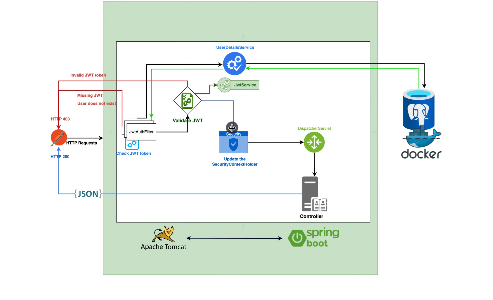

# Spring Boot Security Implementation

## Overview
This project implements a secure authentication system using Spring Boot Security with JWT (JSON Web Token) authentication. The system provides user registration and authentication endpoints, along with secured API routes.

## Authentication Flow

## Features

### Security Configuration
- Stateless session management
- JWT-based authentication
- CSRF protection disabled for API endpoints
- Public endpoints for authentication
- Protected routes requiring authentication

### Authentication Endpoints
All API endpoints are documented in `requests.http` file for easy testing. The following endpoints are available:

- **POST /api/v1/auth/register** - User registration
- **POST /api/v1/auth/authenticate** - User authentication
- **GET /api/v1/demo-controller** - Protected demo endpoint (requires JWT token)

### Security Components

#### JWT Authentication Filter
- Intercepts all incoming requests
- Validates JWT tokens in the Authorization header
- Extracts user details and sets up security context
- Implements `OncePerRequestFilter` for single execution per request

#### User Management
- Custom user implementation with `UserDetails` interface
- Role-based authorization support
- Secure password handling using BCrypt encoding
- Email-based user identification

#### Authentication Provider
- Custom `DaoAuthenticationProvider` configuration
- Username/password authentication
- Integration with `UserDetailsService`

## Technical Implementation

### Authentication Flow
1. User sends registration/login request
2. System validates credentials
3. Upon successful authentication, JWT token is generated
4. Token is returned to client
5. Subsequent requests must include the JWT token in Authorization header

### Security Layers
- **Filter Layer**: JWT authentication filter
- **Provider Layer**: DAO authentication provider
- **User Details Layer**: Custom user details service
- **Password Encoding**: BCrypt password encoder

### Protected Resources
All endpoints except `/api/v1/auth/**` require authentication. Protected endpoints include:
- `/api/v1/demo-controller` - Example protected endpoint

## Dependencies
- Spring Security
- Spring Web
- Spring Data JPA
- Jakarta Persistence
- Lombok
- JWT Implementation

## Security Best Practices
- Stateless authentication
- Encrypted password storage
- Token-based authentication
- Role-based access control
- Secure password encoding
- Protected endpoints

## Testing
All API endpoints can be tested using the provided `requests.http` file in the project root. Simply open it in IntelliJ IDEA and use the built-in HTTP client to execute the requests.
